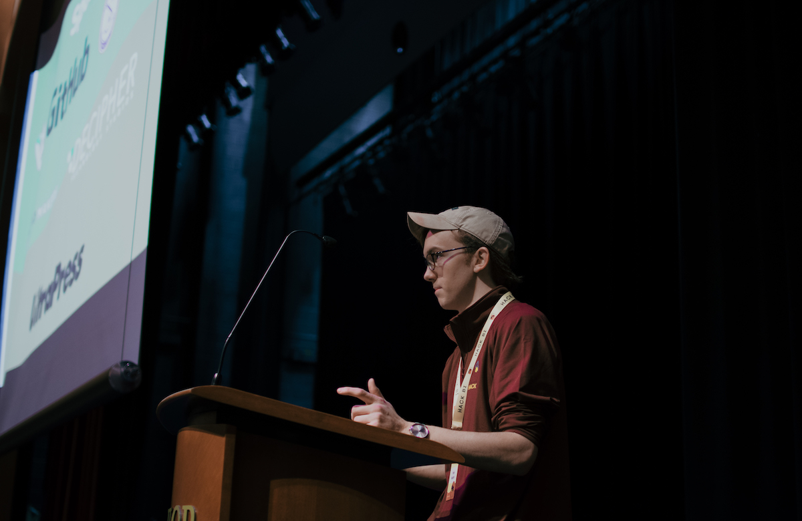
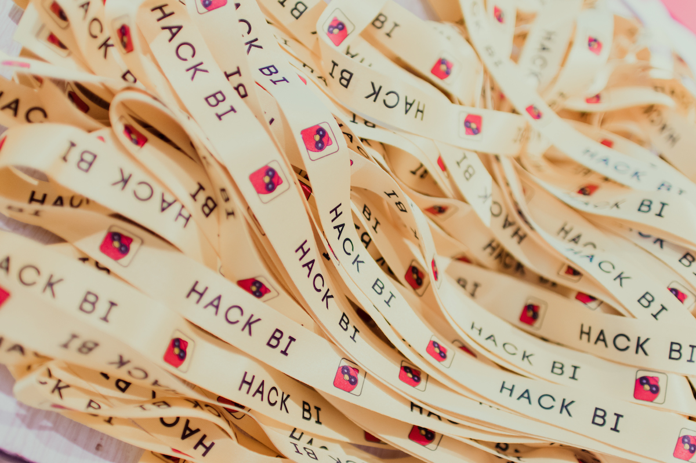

This unnofficial guide is intended to serve as a supplemental resource that you can use to improve your hackathon once you have the basics down and are looking for ways to improve.  This is by no means an exhaustive description of the *perfect* hackathon, rather just a collection of tips and techniques I've observed that someone hopefully finds useful👍   

# Table of Contents
##Advice
   - [Planning](#planning)
   - [Opening/Closing Ceremony](#opening)
   - [Signage](#sign)
   - [Devpost](#devp)
   - [User Experience](#ux)
   - [Communication](#comm)
   - [Judging](#judge)
   - [Prize Categories](#prizes)
   - [Social Media](#social)
   - [Debriefing](#debrief)

##Additional Resources
- [API Quick Links/Troubleshooting](#quickl)  
- [MLH Specific Resources](#mlh)
- [General APIs](#apis)
- [General Resources for Popular Subjects](#general)

---

# Advice
## Planning
- **Be Proactive** - Anything that can be confirmed should be confirmed (*This* Murphy's Law)
- Always be considering what could go wrong with the next big task of the day, whether that's a meal, a workshop, judging, etc. Have a contingency plan for what you and your team can do if something goes wrong.  Try to have such a plan that when something *does* comes up, it’s not a crisis, it’s actually still part of the plan, just a sub-optimal plan B, C,...

  1. **Food:** Call food caterers a day in advance, and then again 2+ hours before the intended delivery time to confirm that everything is still going to be on time and meet specified quantity
  2. **Volunteers:**  Reserve one member of your organizer team to be the designated point of contact for  volunteers: they should know (or have on hand at all times): All the volunteers in the building at any given time, what their responsibilities are, etc.
        - Prepare physical packets (they can be generalized, don’t need to be volunteer-specific) for volunteers that contain:
            * Volunteer responsibilities,
            * The rules of the event,
            * Map of the venue,
            * Time table so they know when/where they’re supposed to be and who is going to replace them,
            * Contact information for all relevant  parties: Lead Organizer, Designated PoC for volunteer organizer,  Adult Moderator, custodian/venue staff (if there’s a chance that people get locked out of certain parts of the venue)
            * Etc. anything that would likely come up that they would otherwise have to find an organizer to figure out.
  3. **Participants:**  Have a *concise* and visually appealing FAQ/info packet (git repo, Google doc, sub-page on website), that is as accessible as possible, because hackers <u>will not</u> use it if it’s not insanely easy to get to and navigate) that contains:
        - Schedule,
        - Map with locations for Workshops, meals, mini-events, etc.
        - Important FAQ  
            - Prize categories and details for eligibility,
            - How to submit to Devpost,
            - How demoing works/what judging is going to be like,
            - [Helpful resources for common APIs](#apis).

        Additionally, knowing that *likely* the majority of your participants will be first time hackers, consider sending out a "What to Expect" or "How to Get the Most Out of Your Hackathon Experience" type of email including some starter resources (see the [General Resources](#general) portion of this guide) so that your hackers can hit the ground running when they arrive!

  4. **A/V check:** Check the day before and again a few hours before presentation resources are needed,
  5. **Volunteers/judges:** Check one week and one day before hand,
  6. **Caterers:** (initial heads up about large order), one day and again a few hours before the expected meal time,
  7. **Scheduling:** Give yourself at least an hour of margin-for-error before/after (as necessary) big tasks on the schedule. Especially between meals and workshop times, give yourself more time for judging than you think you need,

 - Log *everything*: meeting times/durations, attendance, etc.  Maintain a spreadsheet of all the hours contributed by each team member.
    - This helps establish accountability within your team; a bloated team structure hinders overall team effectiveness and culture,
    - Promotes taking pride in your work,
    - Quantifies your efforts which is incredibly useful when soliciting school admin/superior powers for support: *“Last year, our team collectively volunteered x thousand hours towards the success of our event across A, B, C, D categories.”*

##Opening/Closing Ceremony
 - Open with your mission/goals for the participants over the weekend, not logistics – this is your chance to get the participants fired up!
 - Close with logistics (they're still important)
 - Make sure all other speakers know the line-up and have been familiarized with you A/V system to avoid hiccups

##Signage
 - Big and easily identifiable
 - Employ event branding so your signage stands out from existing venue signage

##Devpost
 - Post an [example submission](https://devpost.com/software/hacktj-2019-submission-instructions) that serves as an example for what a final project should look like
 - Have participants submit a placeholder submission the evening before the projects are actually due so you can gauge how many teams you’ll be dealing with, and in what categories you need assign judges
 - Use Devpost's “assign table number” feature rather than your own system for increased compatibility with judging tools such as...
 - [Expo](https://github.com/nealrs/expo) is a great tool that unofficially accompanies Devpost (e.g. filter by prize category; print the resulting page that includes assigned table numbers; distribute to judges; profit!)   
 - Utilize the Devpost [help resources](https://help.devpost.com/hc/en-us), their dev team is super responsive and helpful

##User Experience
 - Prepare as many secondary events/activities as you can manage based on personnel and resources
    - Don’t detract from the hacking purpose of the event, but provide fun activities throughout the weekend that offer a break from coding
  - Workshops:
    - As hackers, you and your team knows what you wish you knew when you first attended a hackathon
    - Put together digestible workshops that help new hackers hit the ground running with a foundation in a given programming language as well as resources they can leverage going forward
    - Practice during regular meetings over the months between events
    - Sponsors are great for providing higher level workshops
    - [MLH localhost!!](https://localhost.mlh.io/)
  - Smash/ping pong tournaments are always hits
  - Trivia and yoga on the rise as well
  - Bingo (sheets at every table based on hackathon achievables e.g. “submit to devpost,” “attend a workshop,” "take out the trash" etc.)
  - Raffles/door prizes:
      - "big" prize for people who checked in on time
      - small (hourly?) prizes - "vintage" stickers from past iterations of your event!
  - CTF puzzle hidden on website/accompanying resources/webpages

##Communication
  - Slack/Discord: Make sure your event staff are identified as such in their display name, including their main role so volunteers/sponsors/participants know who to message for what
  - Ensure clear channel purposes, yet not too many otherwise people get overwhelmed and stop checking at all:
      - \#Announcements (locked),
      - \#General (all),
      - \#Mentors (all) – Check out the Slack Apps such as [Halp](https://blockstack.slack.com/apps/ADBM44F4G-halp?next_id=0) to streamline the ticketing process,
      - \#Memes (all) - very important,
      - \#Event-staff

##Judging
  - **Recommended judging systems:**
      1. Batches + spreadsheet
        - Requires one spreahsheet wizard who divides the teams into batches,
        - Batches are distributed to judges who are instructed to pick their top choice (or top 3 depending on volume of submissions) and report back,
        - spreadsheet wizard records that judge's top 3 and assigns them another batch,
        - Repeat until each team has been seen by multiple judges/groups of judges,
        - Teams with the most top picks win!
      2. Paper Rubric
        - Even inside the tech community, some people prefer pen and paper to jot notes down about projects,
        - Print out a paper rubric with room for notes / scoring in each criterion you deem important,
        - This method does require an allotted time period for deliberation for judges to recapitulate their notes the the bigger group to determine winners - but it's great for smaller events with less-experienced judges
      3. Google Form
        - Prepare a Google form with your criteria,
        - Share this form with your judges,
        - This helps constrain the judges' perspectives to the criteria you deem important,
        - Removes the need for extensive deliberation as you're left with quantitative results
      4. Checkout this [thorough writeup](https://news.mlh.io/how-to-judge-a-hackathon-finding-the-chosen-one-05-15-2014) for more detailed descriptions of how to improve the dreaded judging process  
  - **Example Demos:**
    - Snag winning projects off Devpost from other hackathons if you don’t have time to prepare projects yourself, just be sure not to misrepresent them as your own 😛
    - Present an excellent demo, and an average demo to your judges – this gives them some benchmarks for the quality of demos they should expect
    - Bonus: If using an automated scoring system (e.g. Google Forms), normalize the score distribution from all the judges based off the scores they give to these two example projects that way teams don’t get penalized for harsher judges, or disproportionately advantaged by easily-impressed judges
  - Keep your judging system/criteria simple: judges will only have 3-5 minutes to evaluate teams; you don’t want to bog them down with lots details to keep track of, or a non-intuitive method of recording their scores   

##Prize-categories
 - Along with your event-specific demo categories, it’s a good idea to include catch-all categories to make your demo process as accessible as possible such as:
    - Best First Hack – Majority of teams are composed first-time hackers,
    - People’s Choice	– Requires a poll system or demo phase where people are allowed to go view other people’s hacks,
    - Most Unique Hack
 - Look at other events’ Devpost’s for ideas for categories.

##Social Media
 - Ensure that hackers are ok with having their picture taken at the event via release form
    - Implement a system to distinguish people who would prefer not to be included in images (can be denoted by an alternate lanyard color, etc.)
 - Designate a team member to manage social media: Live Tweet the event!
    - Event setup,
    - Mini-events,
    - Workshops,
    - Demos,
    - Awards Ceremony
 - Maximize user engagement by including media in all posts - people are more likely to click on posts with gifs/pictures/videos than they are a bland, text-only Tweet/link to external site - hence the shameless images of me at a hackathon in this article: you're *engaged*, can you feel it?
 - Remain active year-round to retain followers
 - Crowdsource publicity by creating a Snapchat [geofilter](https://www.snapchat.com/create/submit.html?utm_source=snapchat&utm_medium=site&utm_campaign=community#creative) for the weekend

 
 ##Debriefing
 - Reflecting on the successes and failures of your event throughout the course of planning and executing it is one of the most productive means of improving future iterations:
    - Ask yourself/your team,
    - Ask your participants,
    - Ask your sponsors,
    - Ask your volunteers...

    *"What went well?  What can we do to improve?"*
 - Another helpful reflection structure follows eponymous "Start / Stop / Continue"
    - Compile a list of things that fall into each category and a justification as to why so that future organizers can understand the rationale behind including or removing certain features from your event that aren't necessarily self evident

#API Quick Links / Troubleshooting
##MLH Specific Resources
- [MLH Organizer Guide](https://guide.mlh.io/) - The de facto textbook.

   *“Generally speaking, there are 5 things you need to organize a hackathon – a venue, food, power, wifi, and people. Getting those things right is core to having a successful event.”*

 - Domain.com:
    - **Issue**: The most common issue hackers encounter with the site is caused by higher-than-expected  frequency of domain purchases from a dense region/wi-fi Network.  Domain.com goes into lockdown as it looks like Credit Card fraud, and just prevents any new domain acquisitions until a ‘cooldown’ period has transpired.
    - **Fix**: Unfortunately, the only consistent fix (other than calling Domain.com support) is to wait a few hours then try again.  In order to prevent this measure, encourage hackers to register their domains earlier in the event (most still won’t).  Most teams register a domain after they’ve completed their main project to serve as a landing page, which usually happens in 3-5 hour window before project submission and creates a bottleneck.  Registering your domain first thing helps mitigate this issue.
 - BlockStack:
    - [Documentation page](https://docs.blockstack.org/develop/dapp_principles.html) is very beginner friendly.  
    - User forum/Slack is super active and helpful as well
 - GitHub
    - [GitHub Education](https://education.github.com/) - Register an account as a student and gain access to tons of educational resources and credit towards services including AWS, Heroku, etc.
    - [GitHub Learning Lab](https://lab.github.com/courses) - "Learn GitHub from GitHub"

#General Resources for Popular Subjects

###General APIs
 - This is a pretty [exhaustive list](https://github.com/toddmotto/public-apis) of free APIs for all types of data  

###JavaScript
 - [Daniel Shiffman / Coding Train](https://www.youtube.com/channel/UCvjgXvBlbQiydffZU7m1_aw) - p5.js tutorials on hundreds of topics
 - [fireship.io](fireship.io) - Write ups and videos for various web application tutorials

 ###Python
 - [Automate the Boring Stuff with Python](https://automatetheboringstuff.com/) - An open source book on practical programming for total beginners

###Machine Learning
 - [Sentdex](https://www.youtube.com/watch?v=OGxgnH8y2NM&list=PLQVvvaa0QuDfKTOs3Keq_kaG2P55YRn5v) - Extensive Python ML YouTube playlist with practical implementations of popular libraries as well as explanatory from-scratch reproductions
 - [“Machine Learning for Beginners: An Introduction to Neural Network”](https://victorzhou.com/blog/intro-to-neural-networks/)

 ###Algorithms and Practice Problems
 - [Project Euler](https://projecteuler.net/archives) - Hundreds of practice problems that'll make you cinch your thinking cap's chin-strap
